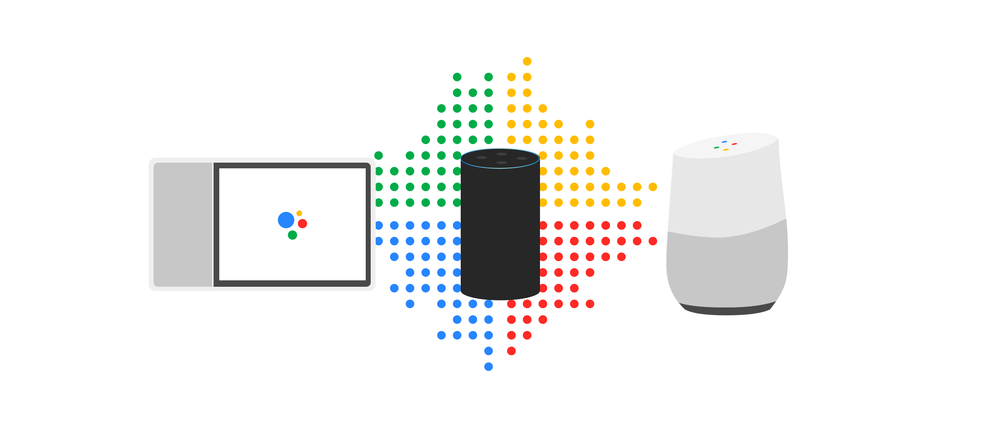

# Smart Speaker Detector for Android

Amazon Alexa and Google Home detection example for Android

Features: 
- Library to detect Amazon Alexa and Google Home devices on local
network
- Application example called Grocr to test the library and notify user
about detected devices

## Approach

We are using an mDNS to find Google Home devices, and ARP table lookup 
to find Alexa devices.

Since Google Home uses Cast SDK, detection should be reliable

Amazon Alexa device detection is experimental and uses MAC address
lookup for devices that typically correspond to an Alexa.

## Example of Detected Google Home Device

  

